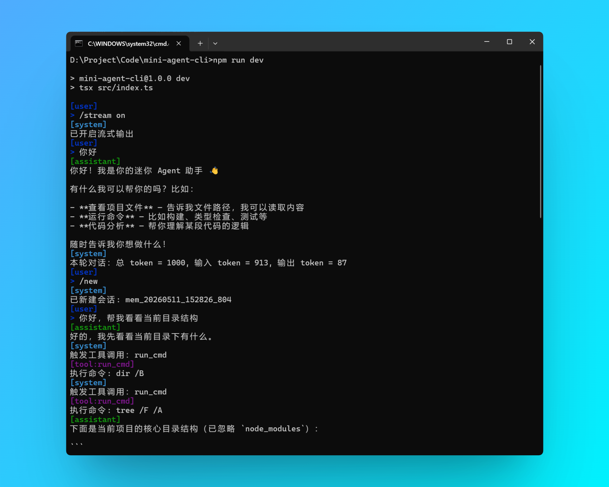

# Mini CLI Agent



## 简介

一个用 **TypeScript 实现的极简 AI Agent CLI**，丐版 Claude Code，模型选择 DeepSeek

> 不使用任何现成的大模型库，手动处理会话记忆、agent 循环等等，😺图一乐

## 功能

- 会话记忆
- 流式输出
- 工具调用：读文件、写文件、执行 cmd 命令

## 启动

```bash
npm run dev
```
